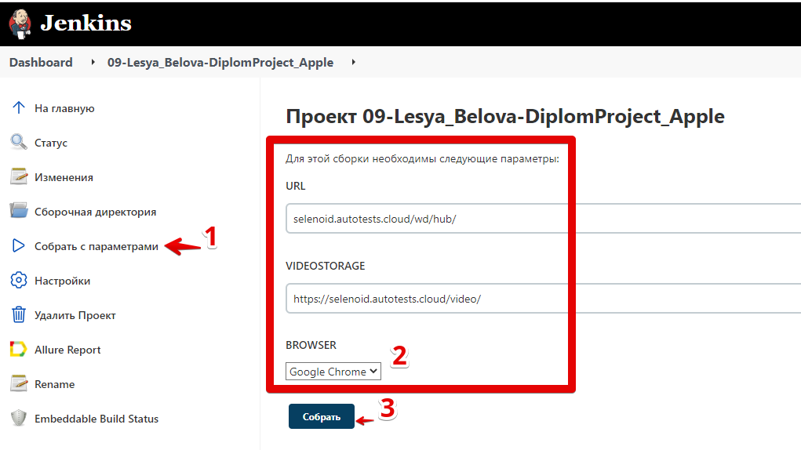
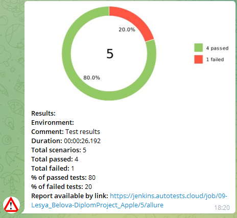

# Ui autotests for https://goldapple.ru/

## :heavy_check_mark: Check-list:

* Check logo on main page
* Check shop title 
* Check search 
* Check contacts
* Console log should not have errors

## Jenkins job
:point_right: Click [here](https://jenkins.autotests.cloud/job/09-Lesya_Belova-DiplomProject_Apple/) 



#### USAGE examples
For run remote tests need fill credentials.properties or to pass value:
```
* browser (default chrome)
* browserVersion (default 91.0)
* browserSize (default 1920x1080)
* remoteDriverUrl (url address from selenoid or grid)
* videoStorage (url address where you should get video)
```

Run test with filled ...properties:
```
gradle clean test
```

Run test with not filled ...properties:
```
gradle clean -DremoteDriverUrl=https://%s:%s@selenoid.autotests.cloud/wd/hub/ -DvideoStorage=https://selenoid.autotests.cloud/video/ test
```

## Test results notifications in Telegram



##  Allure Report in Jenkins


## 

